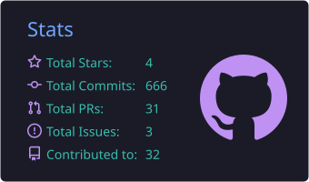
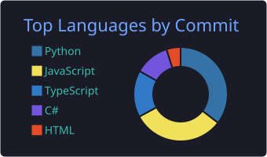
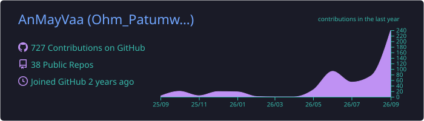

  

<h1 align="center">Hi there, I'm Ohm Patumwan 👋</h1>
<h3 align="center">A Computer Engineering student building across web, blockchain, IoT, and games 🚀</h3>

  

 

---

### 👨‍💻 About Me

- 🎓 I'm a **Computer Engineering** student at King Mongkut's University of Technology North Bangkok (KMUTNB).
- 🌐 I build **full-stack and blockchain web apps** — Next.js, TypeScript, Tailwind, and Solidity smart contracts.
- 🌱 I'm diving deep into **IoT with Raspberry Pi & ESP32**, from sensor drivers to full simulated games.
- 🕹️ I make **2D games with Unity**, and I'm a lifelong learner always excited to build cool stuff.
- 💬 Feel free to ask me anything about **game dev, IoT, or web + blockchain**! I'd love to help.

---

### 🚀 Featured Projects

  
  
   
  
  
   
  
  

- **[FiceTrack](https://github.com/AnMayVaa/FiceTrack-application)** — Flutter app with AI-powered posture analysis to prevent Office Syndrome.
- **[Total Evasion](https://github.com/AnMayVaa/esp32-total-evasion)** — a survival game for ESP32 + ILI9341 display, simulated on Wokwi.
- **[Digital DoorLock](https://github.com/AnMayVaa/Digital_DoorLock)** — Next.js door lock simulation with webcam QR scanning and an admin dashboard.
- **[Reservation Web App](https://github.com/AnMayVaa/reservation-web-app)** — hotel booking app backed by an Ethereum Sepolia smart contract (Next.js 14 + ethers.js).
- **[sixseven](https://github.com/AnMayVaa/sixseven)** — a hand-wave speed challenge using React, MediaPipe, and Supabase.
- **[3D Scanner](https://github.com/AnMayVaa/3D-scanner)** — Python-based 3D scanning with an Intel RealSense D435 camera.

*(Tip: pin these same six on your GitHub profile itself — the top-right "Customize your pins" on github.com/AnMayVaa — so they also show up outside this README.)*

---

### 🛠️ My Tech Stack

  <strong>Languages:</strong> 
  
  
  
  
  
  

  <strong>Frameworks, Platforms & Tools:</strong> 
  
  
  
  
  
  
  
  
  
  
  
  

---

### 📊 My GitHub Stats

  
  

---

### 📈 My Profile Summary

  

---

### 🐍 My Contribution Snake

  <picture>
    <source media="(prefers-color-scheme: dark)" srcset="https://raw.githubusercontent.com/AnMayVaa/AnMayVaa/output/github-snake-dark.svg" />
    <source media="(prefers-color-scheme: light)" srcset="https://raw.githubusercontent.com/AnMayVaa/AnMayVaa/output/github-snake.svg" />
    
  </picture>

---

### 👁️ Visitor Count

  

---

### 📫 Let's Connect!

  
  &nbsp;
  
  &nbsp;
  
  &nbsp;
  

